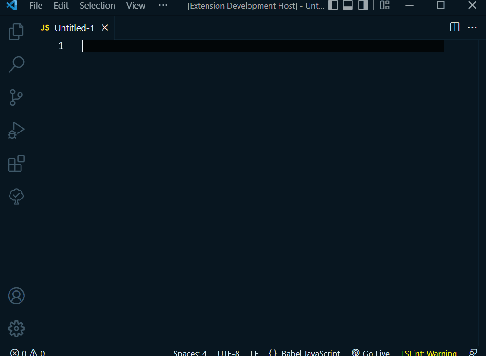

# vue-storybook-snippets README

## Features

This an extension to provide snippets of storybook configures file in a vue project.

## Snippet Prefixes

| Prefix | Description                |
| ------ | -------------------------- |
| fs-    | Snippets for Vue and Storybook |

## Usage

Use `fs-` to help you with some snippets for vue YourComponent.stories.js file automatically.

## Release Notes

### 0.0.1

Initial release.

## License

MIT